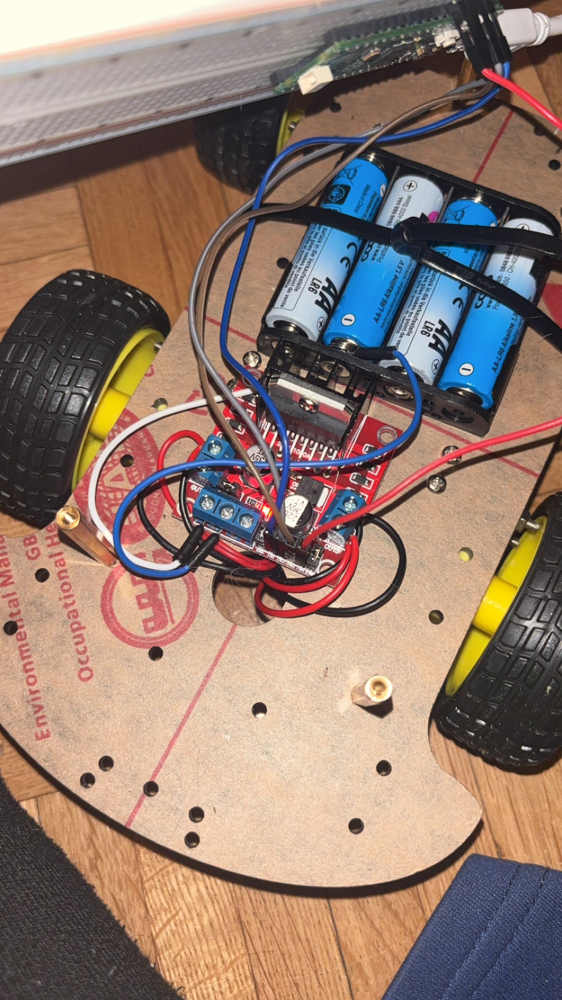
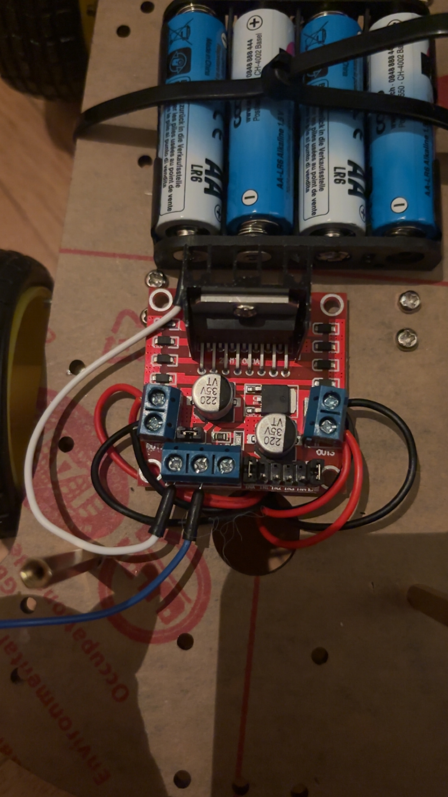

# Construction d’une voiture robotique programmée
## Introduction
Dans le cours d’OC informatique, nous avons décidé de construire et programmer une voiture robotique contrôlée par une carte Raspberry Pi Pico pour notre projet de robotique. 

Le but principal du projet pour nous était de créer quelque chose d’original et complexe afin de mieux comprendre le fonctionnement des composants électroniques, des moteurs, des GPIO et de la programmation en Python afin de faire déplacer une voiture selon un chemin précis. Cela mélange le cours que nous avons fait avec Madame Zenak au premier semestre avec ce que nous avons appris ce semestre.

Ce projet nous a permis d’apprendre à :

1.connecter différents composants électroniques

2.utiliser un driver moteur L298N 

3.programmer les moteurs en Python 

4.contrôler les déplacements de la voiture 

5.comprendre les bases de la robotique et de l’électronique

Le projet est basé sur les notions vues au cours de l’année puis le cours d’introduction à l’électronique et à la robotique avec le Raspberry Pi Pico.  
## Objectif du projet
L’objectif de notre projet était de construire une voiture robotique capable :

1.d’avancer 

2.de reculer 

3.de tourner à gauche et à droite 

4.de suivre un parcours programmé à l’avance. 

Nous voulions également comprendre comment contrôler des moteurs grâce aux GPIO du Raspberry Pi Pico et au module L298N.  

Notre projet s’inspire du fonctionnement du robot Thymio que nous avions programmé auparavant avec Madame Zenak. Dans ce premier projet, le robot utilisait des capteurs, des LEDs et des sons pour effectuer une séquence automatique.  
## Répartition du travail

Lily : branchements électroniques et les textes 

Nikita : branchements électroniques et le code

Ensemble: recherche d’informations et de matériels 
## Matériel utilisé
Pour construire la voiture robotique, nous avons utilisé plusieurs composants électroniques.  
### Liste des composants
1.Raspberry Pi Pico 

2.Driver moteur L298N

3.Breadboard

4.Châssis 4 roues motrices

5.4 moteurs DC

6.Batterie / boîtier piles

7.Fils Dupont

8.Câble micro-USB
### Utilité des composants

#### Raspberry Pi Pico:

Le Raspberry Pi Pico est le cerveau de la voiture. Il exécute le programme Python et envoie les instructions aux moteurs.  

#### Driver moteur L298N:

Le module L298N sert d’intermédiaire entre la carte Pico et les moteurs. Il permet d’alimenter les moteurs avec suffisamment de puissance.  

#### Breadboard:

La breadboard permet de connecter les composants sans devoir faire de soudure.  

#### Châssis 4 roues motrices:

C’est le “corps” de la voiture.

Il sert à tenir tous les composants, fixer les moteurs, supporter les roues et transporter la batterie et l’électronique.

#### 4 moteurs DC:

Ce sont eux qui font tourner les roues.

DC signifie “Direct Current” = courant continu.

Quand on leur envoie de l’électricité, ils tournent donc la voiture avance.

#### Batterie / boîtier piles:

Il fournit l’énergie électrique.
Sans batterie les moteurs ne peuvent pas tourner.
La batterie alimente le L298N et les moteurs.

#### Fils Dupont:

Ils servent à connecter les composants électroniques.

Par exemple :
Pico → L298N
capteurs → Pico

Ce sont les “routes” pour transporter les signaux électriques.

#### Câble micro-USB:

Il sert à alimenter le Raspberry Pi Pico et envoyer le programme depuis l’ordinateur
Donc ordinateur → Pico

#### GPIO:

Les GPIO permettent au Raspberry Pi Pico d’envoyer des signaux électriques aux moteurs. 

#### PWM:

La technologie PWM permet de contrôler la vitesse des moteurs grâce au rapport cyclique du signal.  
## Schéma et connexions

Pour construire la voiture robotique, nous avons commencé par assembler le châssis.
Nous avons d’abord vissé les supports du toit sur la plaque de base. Ensuite, nous avons fixé les supports des moteurs avant de visser les moteurs sur la structure principale.

Après le montage mécanique, nous avons organisé les connexions des moteurs. Nous avons regroupé les fils rouges et noirs des moteurs de gauche par couleur, puis nous avons fait la même chose pour les moteurs de droite.

Les branchements sur le module L298N ont été réalisés de la manière suivante :

1.les fils rouges des moteurs de gauche ont été connectés à la sortie OUT1 

2.les fils noirs des moteurs de gauche ont été connectés à la sortie OUT2 

3.les fils rouges des moteurs de droite ont été connectés à la sortie OUT3 

4.les fils noirs des moteurs de droite ont été connectés à la sortie OUT4.

Ensuite, nous avons inséré les piles dans le boîtier d’alimentation et nous l’avons fixé au châssis avec des attaches zippées afin qu’il reste stable pendant les déplacements de la voiture.
Après cela, nous avons connecté le boîtier à piles au module L298N………. Enfin, nous avons vissé le toit du châssis pour terminer l’assemblage.

Les connexions utilisées correspondent au schéma étudié pendant le projet :

GP2 → IN1

GP3 → IN2

GP4 → IN3

GP5 → IN4

GP0 → ENA

GP3 → ENB

Le schéma de connexion: 

## Code

## Explication de code
Le programme a été écrit en MicroPython.

from machine import Pin, PWM = Importe les outils pour contrôler les pins et le PWM du Pico.

import time = Importe l'outil pour faire des pauses.

ENA = PWM(Pin(0)) = La pin 0 contrôle la vitesse du moteur gauche via PWM (signal qui pulse rapidement).

IN1 = Pin(4, Pin.OUT)

IN2 = Pin(5, Pin.OUT)

= Les pins 4 et 5 contrôlent le sens du moteur gauche (avant/arrière).

ENB = PWM(Pin(3))

IN3 = Pin(6, Pin.OUT)

IN4 = Pin(7, Pin.OUT)

= Pareil mais pour le moteur droit.

ENA.freq(1000)

ENB.freq(1000)

= Le signal PWM pulse à 1000 fois par seconde.

ENA.duty_u16(45000)

ENB.duty_u16(45000)

= Met la vitesse à environ 70% (45000 sur 65535 maximum).

IN1.high(); IN2.low()

IN3.low(); IN4.low()

= Moteur gauche tourne dans le sens 1, moteur droit à l'arrêt.

time.sleep(2)

Attend 2 secondes avant de passer à l'étape suivante.

Les 4 blocs suivants font pareil mais testent les différentes combinaisons de sens pour chaque moteur.

Sens 1 = IN1.high(); IN2.low() → ta voiture recule

Sens 2 = IN1.low(); IN2.high() → ta voiture avance

## Probleme avec le code
On a eu un enorme probleme dans le programme lorsque la voiture était censée avancer tout droit, deux roues ne fonctionnaient pas correctement. À cause de cela, la voiture tournait sur elle-même au lieu d’avancer normalement.

Comme on peut le voir dans la vidéo du projet, le déplacement n’était donc pas celui que nous avions prévu au départ.

Nous avons essayé plusieurs solutions pour résoudre ce problème. Tout d’abord, nous avons tenté d’inverser les moteurs et les branchements afin de vérifier si le problème venait des connexions. Ensuite, nous avons essayé de modifier différentes parties du code pour corriger le sens de rotation des moteurs et ajuster les déplacements. Malgré plusieurs tests et modifications, le problème continuait.

Après avoir essayé de nombreuses solutions sans réussir à faire avancer correctement la voiture, nous avons finalement décidé d’adapter le projet à ce fonctionnement. Nous avons donc changé l’idée du parcours afin que la voiture recule puis tourne sur elle-même, ce qui fonctionnait beaucoup mieux avec notre système.

Même si le résultat final était différent de l’idée de départ, cette difficulté nous a permis de mieux comprendre le fonctionnement des moteurs, des branchements et de la programmation des déplacements.
## Connexions
### Connexions alimentation
1 piles 6V +  → L298N 12V

1 piles 6V -  → L298N GND

### Alimentation de la Pico
Batteries → L298N  → Pico

### Connexions moteurs
Avec le L298N, on contrôles 2 côtés, pas 4 moteurs séparément.

Moteurs gauche avant + arrière → OUT1 / OUT2

Moteurs droite avant + arrière → OUT3 / OUT4

Donc les 2 moteurs de gauche sont branchés ensemble, et les 2 moteurs de droite ensemble.

### Connexions Pico → L298N
Pico GP2 → IN1

Pico GP3 → IN2

Pico GP4 → IN3

Pico GP5 → IN4

Pico GP0 → ENA

Pico GND → ENB

Résumé schéma

Pico GP2 ─── IN1     OUT1 ── moteurs gauche

Pico GP3 ─── IN2     OUT2 ── moteurs gauche

Pico GP4 ─── IN3     OUT3 ── moteurs droite

Pico GP5 ─── IN4     OUT4 ── moteurs droite

Pico GP0─── ENA

Pico GND─── ENB

Pile 6V + ── L298N 12V

Pile 6V - ── L298N GND

## Difficultés rencontrées et solutions
L’une des principales difficultés rencontrées pendant ce projet concernait les branchements électroniques. Au début, il était difficile de savoir exactement où connecter chaque composant pour que la voiture fonctionne correctement. Nous devions comprendre où brancher les moteurs, le Raspberry Pi Pico, le module L298N et l’alimentation sans faire d’erreur.

Nous avions également peur d’endommager les composants électroniques en réalisant un mauvais branchement. Il fallait faire très attention à la polarité des fils, aux connexions GND et aux tensions utilisées afin de ne pas brûler le Raspberry Pi Pico ou le driver moteur. Grâce au cours, nous avons appris l’importance des pins d’alimentation, des GPIO et des connexions à la masse (GND).  

La plus grande difficulté a été le branchement des batteries sur le module L298N. Nous ne savions pas au début comment connecter correctement le boîtier de piles au driver moteur pour alimenter les moteurs sans créer de court-circuit. Il faut savoir que notre boîtier de pile a été acheté tel quel et ne venait pas avec les câbles directement attachés dessus, ce qui rendait impossible la connexion entre le boîtier de pile et le L298N. Cette partie est très importante puisqu' elle sert à alimenter la voiture entière. Il n’y avait que quelques possibilités dont la soudure, ce que nous ne savions bien sûr pas faire. Nous avons finalement opté pour la solution suivante, nous avons coincé les câbles dans les entrées de la boîte de batterie afin qu’ils tiennent correctement, puis nous avons connecté le câble positif (+) sur l’entrée 12V/VIN du module L298N et le câble négatif (-) sur le GND du L298N. Grâce à cette solution, nous avons réussi à alimenter correctement le circuit et les moteurs de la voiture. (Merci beaucoup Monsieur Rordorf pour votre aide)

Les problèmes concernant le code n’étaient pas nombreux comme on a eu l’aide de Claude, une IA experte en informatique. Bien sûr, il a fallu changer beaucoup de choses pour l’adapter à notre projet. Un des problèmes était qu’il n’était pas possible de vérifier le code sans connecter le Raspberry Pi à l’ordinateur car le module “machine” se trouve seulement installé dans le Pico. Puis l'autre probleme qu'on avait etait celui qu'on vous a expliquer dans les problems avec le program.

## Comparaison avec le projet Thymio
Ce projet était inspiré de notre ancien projet avec le robot Thymio.

Dans le projet Thymio le robot détectait des lignes noires, il changeait de couleur, il jouait des sons, il utilisait plusieurs états et variables pour gérer ses actions.

Grâce à cette première expérience, nous avons mieux compris la logique de programmation, les variables d’état, la gestion des mouvements automatiques, l’organisation du code.

Le projet voiture était cependant plus difficile car nous devions aussi réaliser les branchements électroniques, créer un code plus complexe en prenant en compte les nouveaux composants et gérer l’alimentation des moteurs. 
## Améliorations possibles
Si nous avions plus de temps, nous aimerions :

1.ajouter un module Bluetooth pour contrôler la voiture à distance 

2.ajouter des LEDs

3.trouver comment regler le code pour que ca marche exactement comme on voulais

4.programmer une télécommande sur téléphone 

5.rendre les déplacements plus précis 

6.personnaliser davantage la voiture pour qu’il ressemble à Flash McQueen 

7.faire un code plus elaboré
## Conclusion
Ce projet nous a permis de découvrir les bases de la robotique et de l’électronique avec le Raspberry Pi Pico.
Nous avons appris à :

connecter des composants

programmer des moteurs 

utiliser le PWM 

comprendre le fonctionnement des GPIO 

construire une voiture robotique complète

Ce projet nous a également permis de développer notre logique de programmation, notre travail d’équipe et notre autonomie.
Pour conclure, ce projet nous a permis de découvrir concrètement le monde de la robotique, de l’électronique et de la programmation avec le Raspberry Pi Pico. Grâce à la construction de cette voiture robotique, nous avons appris à connecter différents composants électroniques, à utiliser un module L298N, à programmer des moteurs en Python et à comprendre le fonctionnement des GPIO et du PWM.

Même si nous avons rencontré plusieurs difficultés, notamment avec les branchements, l’alimentation des batteries et le fonctionnement des moteurs, nous avons réussi à trouver des solutions et à adapter notre projet pour qu’il fonctionne correctement. Ces problèmes nous ont permis d’apprendre à tester, corriger et améliorer notre travail étape par étape.

Ce projet nous a également appris à travailler en équipe, à partager les tâches et à être patients face aux erreurs techniques. Malgré les difficultés rencontrées, nous sommes contents du résultat final et fiers d’avoir réussi à construire et programmer notre propre voiture robotique.

Enfin, ce projet nous a donné envie d’aller plus loin dans la robotique et la programmation en ajoutant plus tard des capteurs, un contrôle Bluetooth ou encore des mouvements plus complexes.

