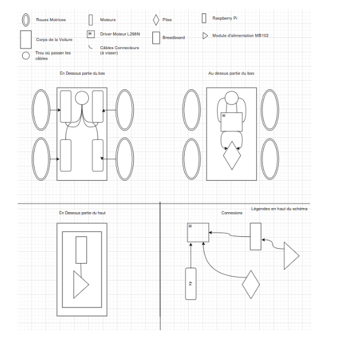

# Construction d’une voiture robotique programmée
## Introduction
Dans le cours d’OC informatique, nous avons décidé de construire et programmer une voiture robotique contrôlée par une carte Raspberry Pi Pico pour notre projet de robotique. 

Le but principal du projet pour nous était de créer quelque chose d’original et complexe afin de mieux comprendre le fonctionnement des composants électroniques, des moteurs, des GPIO et de la programmation en Python afin de faire déplacer une voiture selon un chemin précis. Cela mélange le cours que nous avons fait avec Madame Zenak au premier semestre avec ce que nous avons appris ce semestre.

Ce projet nous a permis d’apprendre à :

1.connecter différents composants électroniques

2.utiliser un driver moteur L298N 

3.programmer les moteurs en Python 

4.contrôler les déplacements de la voiture 

5.comprendre les bases de la robotique et de l’électronique

Le projet est basé sur les notions vues au cours de l’année puis le cours d’introduction à l’électronique et à la robotique avec le Raspberry Pi Pico.  
## Objectif du projet
L’objectif de notre projet était de construire une voiture robotique capable :

1.d’avancer 

2.de reculer 

3.de tourner à gauche et à droite 

4.de suivre un parcours programmé à l’avance. 

Nous voulions également comprendre comment contrôler des moteurs grâce aux GPIO du Raspberry Pi Pico et au module L298N.  

Notre projet s’inspire du fonctionnement du robot Thymio que nous avions programmé auparavant avec Madame Zenak. Dans ce premier projet, le robot utilisait des capteurs, des LEDs et des sons pour effectuer une séquence automatique.  
## Répartition du travail

Lily : branchements électroniques et les textes 

Nikita : branchements électroniques et le code

Ensemble: recherche d’informations et de matériels 
## Matériel utilisé
Pour construire la voiture robotique, nous avons utilisé plusieurs composants électroniques.  
### Liste des composants
1.Raspberry Pi Pico 

2.Driver moteur L298N

3.Breadboard

4.Châssis 4 roues motrices

5.4 moteurs DC

6.Batterie / boîtier piles

7.Fils Dupont

8.Module d’alimentation

9.Câble micro-USB
### Utilité des composants

Raspberry Pi Pico:

Le Raspberry Pi Pico est le cerveau de la voiture. Il exécute le programme Python et envoie les instructions aux moteurs.  

Driver moteur L298N:

Le module L298N sert d’intermédiaire entre la carte Pico et les moteurs. Il permet d’alimenter les moteurs avec suffisamment de puissance.  

Breadboard:

La breadboard permet de connecter les composants sans devoir faire de soudure.  

GPIO:

Les GPIO permettent au Raspberry Pi Pico d’envoyer des signaux électriques aux moteurs. 

PWM:

La technologie PWM permet de contrôler la vitesse des moteurs grâce au rapport cyclique du signal.  
## Schéma et connexions

## Code

